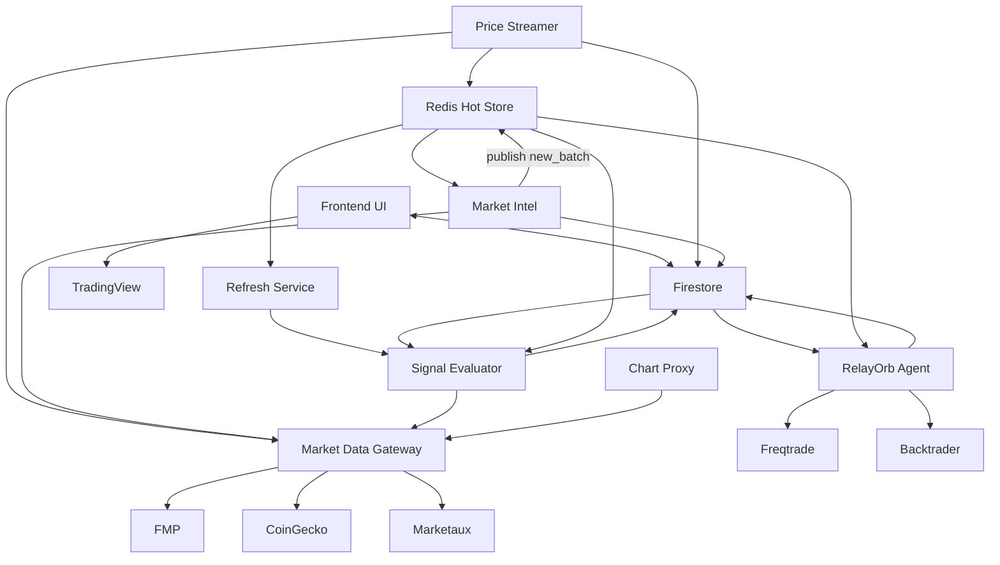

# RelayOrb Architecture - Multi-Asset Intelligence Platform

## Overview
RelayOrb is a multi-asset market intelligence platform that provides trading signals across cryptocurrencies, stocks, and forex markets. It analyzes market trends, generates buy/sell signals, and tracks prediction accuracy.

## Core Components

### 1. Market Intelligence Engine (Primary)
**Location:** `deploy/market-intel/`  
**Runs:** Google Cloud Run (every 5 minutes)

The brain of the platform that:
- Fetches real-time data for ALL asset classes:
  - **Crypto:** CoinGecko movers + FMP intraday deltas (via market-data-gateway)
  - **Stocks/TSX/FX:** Live price snapshots from `market/prices` (price streamer via market-data-gateway)
  - **News/Sentiment:** Marketaux (via market-data-gateway, optional)
- Generates trading signals based on:
  - Momentum analysis (15m, 1h, 24h, 7d changes)
  - Volume anomalies
  - News sentiment
  - Bot signals from Freqtrade + Backtrader
- Uses OpenAI to explain WHY assets are trending
- Tracks prediction accuracy over multiple horizons
- Self-improves through auto-tuning with AI assistance

**Key Features:**
- Cross-asset correlation analysis
- Market regime detection (risk-on/off)
- Synthetic signal generation for all assets
- Accuracy tracking and self-improvement

### 2. Price Streamer (Live Prices)
**Location:** `deploy/price-streamer/`  
**Runs:** Cloud Run service (always-on)

Streams near real-time prices into Firestore:
- **Crypto:** FMP quote polling via market-data-gateway for tracked symbols
- **Stocks/FX:** FMP quote polling via market-data-gateway for tracked symbols

Writes to `market/prices` for live UI updates and paper trading.

### 3. Technical Analysis Engines (Bots)
**Location:** `deploy/bot-host/`  
**Components:** Freqtrade (crypto), Backtrader (stocks/FX)

Provides bot signals for scoring:
- Freqtrade for crypto strategies and indicators
- Backtrader for stock/FX strategies and indicators
- Feeds signals to Market Intel for enhanced scoring

**Why keep both:**
- Proven indicator libraries
- Keeps bot layer lightweight
- Enhances cross-asset signal confidence

### 4. Signal Evaluator
**Location:** `deploy/signal-evaluator/`

Evaluates historical signals against actual market outcomes:
- Tracks accuracy over 1h, 24h, 7d horizons
- Handles market hours for stocks/forex
- Provides performance metrics for dashboard
- Feeds accuracy data back for auto-tuning

### 5. Web Dashboard
**Location:** `src/`  
**Hosting:** Firebase Hosting

User interface showing:
- Hot trades across all markets
- Trending assets with AI explanations
- Signal accuracy metrics
- Market status indicators
- Paper trading capabilities

## Data Flow



## Firestore Schema

### Market Collections
- `market/hotTrades` - Top trading opportunities across all assets
- `market/trending` - Trending assets by time horizon
- `market/popular` - AI-curated popular picks
- `market/universe` - User's watchlist configuration
- `market/controls` - System parameters and weights
- `market/prices` - Live price feed
- `market/prices_snapshot` - Snapshot fallback from market-intel

### Bot Collections
- `bots/{botId}` - Bot metadata and status
- `bots/{botId}/signals` - Trading signals
- `bots/{botId}/events` - Event stream
- `bots/{botId}/commands` - Command queue

### Analytics
- `analytics/signalPerformance` - Historical accuracy metrics

## Hot Data Store (Redis)

Redis stores short-lived price windows and snapshots used for 15-minute movers and real-time scoring.
Firestore remains the latest-state store for UI and configs.
- `analytics/botAccuracy` - Per-bot accuracy tracking

## Deployment

### Google Cloud Platform
- **Cloud Run:** Market-intel job (scheduled every 5 minutes)
- **Cloud Run:** Price streamer service (live prices)
- **Cloud Run:** Market data gateway (centralized vendor access)
- **Cloud Scheduler:** Triggers market-intel execution
- **Secret Manager:** API keys (FMP, Marketaux, OpenAI)
- **Firestore:** NoSQL database for all data
- **Firebase Hosting:** Web dashboard

### Bot Host (VM or Local)
- **Docker Compose:** Orchestrates services
- **Freqtrade:** Crypto technical analysis
- **Backtrader:** Stock/FX technical analysis
- **RelayOrb Agent:** Syncs bot data to Firestore

## Configuration

### Environment Variables (Cloud Run)
- `MARKET_DATA_GATEWAY_URL` - Centralized market data service
- `OPENAI_API_KEY` - AI explanations
- `EMIT_MARKET_SIGNALS` - Enable signal generation
- `MARKET_SIGNAL_LIMIT` - Signals per asset class
- `HOT_TRADES_LIMIT` - Number of hot trades
- `CRYPTO_LIMIT` - Crypto pairs to analyze

### Firebase Configuration
- `market/controls` - Runtime configuration
  - `trendWeights` - Weight factors for scoring
  - `autoTuneEnabled` - Self-improvement toggle
  - `enableLLM` - AI explanations toggle
  - `assetFocus` - Which markets to analyze

## Why This Architecture?

### Simplified Stack
- **Single database:** Firestore only
- **Lean bot layer:** Freqtrade + Backtrader only
- **Clear data flow:** Snapshots → scoring → Firestore

### Benefits
1. **True Multi-Asset Coverage:** Stocks, forex, and crypto in one platform
2. **AI-Powered Intelligence:** Explains market movements in plain language
3. **Self-Improving:** Tracks accuracy and auto-tunes for better performance
4. **Minimal Complexity:** One main engine + two lightweight bot engines
5. **Cost-Aware:** Snapshot cadence is tuned for FMP limits
6. **Scalable:** Cloud Run scales automatically with demand

## Future Enhancements

### Short Term
- Add more technical indicators to market-intel
- Integrate additional data sources (Yahoo Finance, IEX Cloud)
- Implement alerts for high-confidence signals

### Long Term
- Build custom adapters for stock/forex brokers (Alpaca, OANDA)
- Add options and futures analysis
- Implement portfolio optimization
- Create mobile app

## Getting Started

1. **Set up Firebase:**
   ```bash
   firebase init
   firebase deploy
   ```

2. **Deploy Market Intel:**
   ```bash
   cd deploy/market-intel
   # Follow README for Cloud Run deployment
   ```

3. **Run Bot Host (Optional for crypto TA):**
   ```bash
   cd deploy/bot-host
   docker compose up -d
   ```

4. **Configure Universe:**
   - Open dashboard
   - Set your watchlist for each asset class
   - Configure risk preferences

## Conclusion

RelayOrb is now a streamlined, powerful multi-asset intelligence platform that provides actionable trading signals across all major markets. The architecture prioritizes simplicity, accuracy, and user value over technical complexity.
